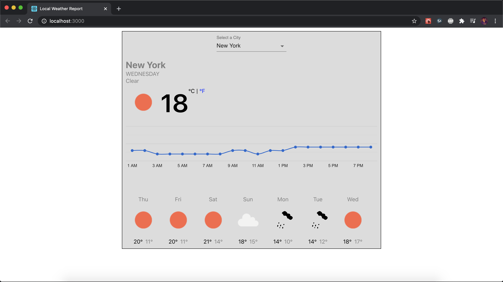

# Local Weather Report



## Project Features
- Weather information for 10 major cities in USA
- Get Current Temperature as well as Current Weather Condition
- Toggle temperature between Celsius and Fahrenheit
- Get historical weather data for the past week:
    - Min temperature
    - Max temperature
    - Weather Condition
- Get Hourly temperature for selected date in chart graphical representation.

## Technology Stack
- React (Frontend)
- Spring Boot (Backend)
- MongoDb (Database)

## Prerequisites
Ensure following is installed and available in your system:
- [Java 11](https://www.oracle.com/java/technologies/javase-jdk11-downloads.html)
- [Maven](https://maven.apache.org/install.html)
- [MongoDb](https://docs.mongodb.com/manual/installation/)
- [Yarn](https://classic.yarnpkg.com/en/docs/install)

## Steps to start the app:
- Clone this repository
    ```
    git clone git@github.com:shah-tejas/LocalWeatherReport.git
    ```
- Change directory
    ```
    cd LocalWeatherReport
    ```
- Start the backend service:
    - Ensure Mongodb daemon is running
    - Change Directory to `weather-api`
        ```
        cd weather-api
        ```
    - Start the app
        | :exclamation:  This app replies on Weather data from OpenWeather API. Please get an API key for this api [here](https://openweathermap.org/appid) and replace the API key in the below command                                |
        |-----------------------------------------------------------------------------|
        ```
        mvn spring-boot:run -Dspring-boot.run.arguments=--WEATHER_API_KEY=${API KEY HERE}
        ```
        | :exclamation: Please wait while the app loads and fetches the weather data and says "Fetching weather data completed!" |
        |-----------------------------------------------------------------------------|
    - Once ready the api will be started on `http://localhost:8080`
- Start the frontend:
    - In a new terminal Change directory to `weather-ui`
        ```
        cd weather-ui
        ```
    - Install yarn dependencies
        ```
        yarn install
        ```
    - Start the app
        ```
        yarn start
        ```
    - Once ready the app will be started on `http://localhost:3000/`

